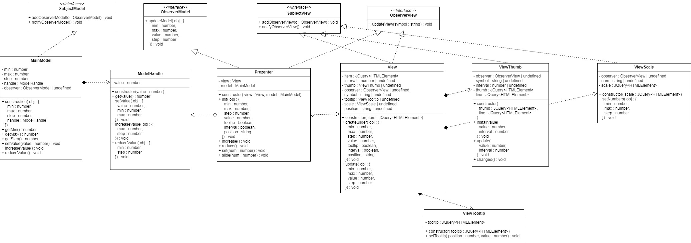

# Fullstack-Development-4-task      https://darklol1.github.io/Fullstack-Development-4-task/
### Собрать проект
```
npm run build
```
### Запустить сервер
```
npm start
```
### Запустить тесты
```
npm test
```
### Инициализация
```js
(function($){                                
    $('.root-slider').myPlugin();          
})(jQuery);                             
```
### Конфигурация 
```js
Cвойство  Значение по умолчанию        Описание
    min:        0                     минимальное значение
    max:        100                   максимальное значение
    step:       25                    задает размер шага
    value:      [0]                     задает значение бегунка
    tooltip:   false                  создает подсказку над бегунком
    range:      1                     создает несколько значений
    position: 'horizontal'            задает вид. Альтернативное значение - 'vertical'
Пример
(function($){                                
    $('.root-slider').myPlugin({
        min: 10,
        max: 200,
        value: [20],
        step: 10,
        tooltip: true,
        interval: true,
        position: 'vertical'
    });          
 })(jQuery);   
```
### Методы плагина
```js
Value
(function($){                                
    $('.root-slider').myPlugin('value');   возвращает значение бегунка       
})(jQuery);  

(function($){                                
    $('.root-slider').myPlugin('value', '50');   задает значение бегунка       
})(jQuery);
```
### События
```js
Slide 
(function($){                                
    $('.root-slider').myPlugin(slide : function (num : number[]) {      выполняет функцию при каждом изменении  
    $('.root-input2').val(num);                                         значения бегунка.    
  });                                                                 
})(jQuery);
```


Я отвязываю слои приложения посредством паттерна Наблюдатель. Prezenter подписан на события в Model и на события во View. Также View подписан на события ViewTooltip. Данные значения бегунка хранятся в ModelHandle и передаются сначала в Model. В Model хранятся минимальное значение, максимальное значение, размер шага. Дальше эти данные передаются в Prezenter, а после идут в View, где уже View обновляет ViewTooltip и ViewThumb. При событии в ViewThumb посредством перетаскивания бегунка через подписку View получает значение, передает в Prezenter, тот в Model. А Model в ModleHandle и так по кругу.

