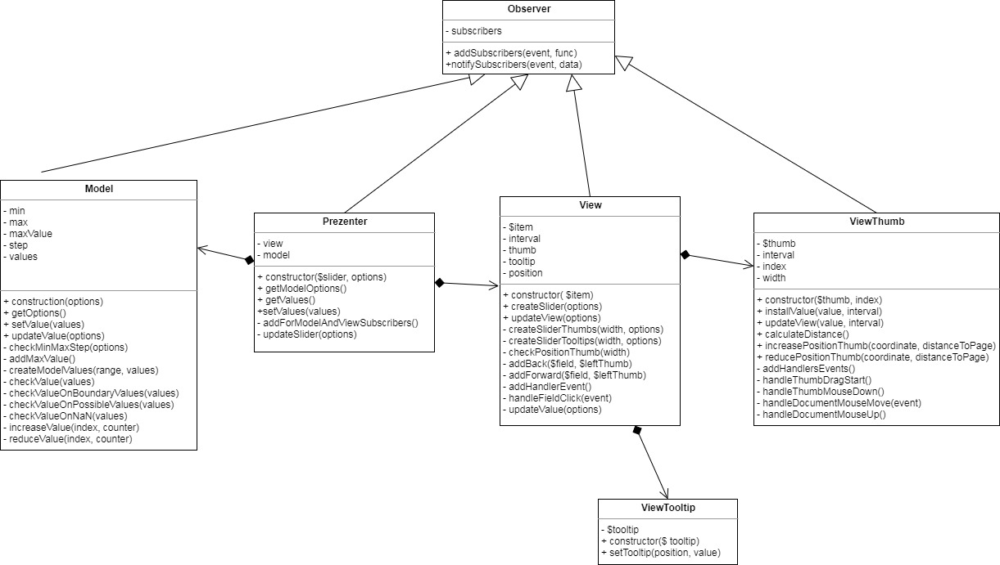

# Fullstack-Development-4-task     https://darklol1.github.io/Fullstack-Development-4-task/

### Собрать проект
```
npm run build
```

### Запустить сервер
```
npm start
```

### Запустить тесты
```
npm test
```

### Запустить линтер
```
npm lint
```

### Инициализация
```js                              
$('.root-slider').myPlugin();                                       
```
### Конфигурация 
```js
Cвойство  Значение по умолчанию        Описание
  min:       0                     минимальное значение 
  max:       100                   максимальное значение
  step:      25                    задает размер шага
  value:     [0]                   задает значение бегунка
  tooltip:   false                 создает подсказку над бегунком
  range:     false                 создает несколько значений
  position: 'horizontal'           задает вид. Альтернативное значение - 'vertical'

Пример                              
$('.root-slider').myPlugin({
  min: 10,
  max: 200,
  value: [20, 40],
  step: 10,
  tooltip: true,
  range: 2,
  position: 'vertical'
});             
```

### Методы плагина
```js
Value                         
$('.root-slider').myPlugin('value');         возвращает значение бегунка                               
$('.root-slider').myPlugin('value', '50');   задает значение бегунка       

Slide                         
$('.root-slider').myPlugin('slide',(values) => {    выполняет функцию при каждом
    $('.root-input2').val(values[0]);               изменении значения бегунка
});                       
```

Я отвязываю слои приложения посредством паттерна Наблюдатель. Prezenter подписывает методы на события в Model и  View. Также View подписан на события ViewTooltip. В Model хранятся минимальное значение, максимальное значение, размер шага и массив значений. Дальше эти данные передаются в Prezenter, а после идут в View, где уже View обновляет ViewTooltip и ViewThumb. При событии в ViewThumb посредством перетаскивания бегунка через подписку View увеличит или уменьшит значение в Model.

